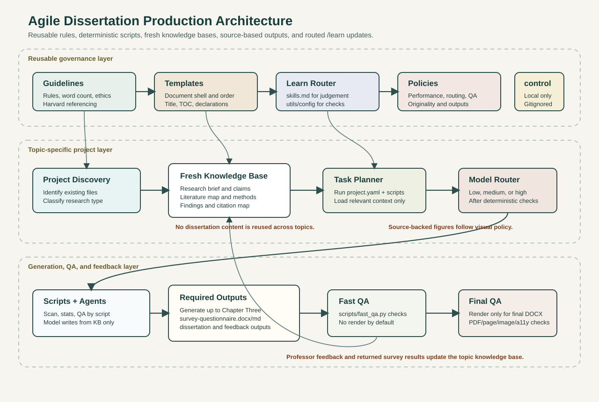

# Dissertation Production Architecture

This repository provides a reusable architecture for producing dissertation artefacts from a topic, university guidelines, templates, source material, feedback, survey results, datasets, and project-specific evidence.

If a project starts with only a **topic name** and a **guideline document**, the architecture first reads and structures the available material before generating any final output. It does not treat the dissertation document as the source of truth. The source of truth is the project knowledge base built from the supplied artefacts.



## What Happens When A Project Is Added

When a new project folder is created and a topic/guideline document is added, the architecture follows this route:

1. **Project discovery**
   - Scans the project folder.
   - Identifies guidelines, templates, existing drafts, feedback, datasets, survey files, images, code, outputs, and missing items.
   - Writes `project-discovery.md`.

2. **Existing file review**
   - Inspects existing project files before generation.
   - Reads text, DOCX, spreadsheet, and structured files where possible.
   - Records the result in `qa/artifact-gate-report.md`.

3. **Guideline extraction**
   - Extracts structure, word count, referencing, formatting, assessment, ethics, and submission rules.
   - Stores reusable or project-specific rules in the correct location.

4. **Project classification**
   - Classifies the project as survey-based, mixed-methods, secondary/case-study, coding/experiment-based, dashboard/data-driven, or conceptual.
   - Uses the classification to decide which outputs and evidence are required.

5. **Knowledge-base creation**
   - Builds structured project memory in `knowledge-base/`.
   - Separates research claims, literature, methodology, findings, citations, feedback, and project-specific instructions.

6. **Dataset or survey route**
   - Survey projects generate a questionnaire only after the pre-survey package is ready.
   - Coding or experiment-based projects identify suitable officially available datasets, benchmarks, simulators, APIs, or experiment logs when data is not supplied.
   - Dataset choice is recorded with source, licence/access terms, relevance, selection criteria, preprocessing, split, and limitations.

7. **Output generation**
   - Generates only the approved stage/output.
   - Uses the active guideline, template rules, project knowledge base, and validated evidence.
   - Keeps previous dissertation topics isolated from the new project.

8. **Quality checks**
   - Runs deterministic checks for word count, structure, tables, figures, captions, survey statistics, citation presence, placeholders, and submission-facing wording.
   - Runs benchmark checks against the target quality band.
   - Runs render/layout QA for final DOCX when required and available.

9. **Final output**
   - Places generated outputs in `projects/<topic>/outputs/`.
   - Places QA reports in `projects/<topic>/qa/`.
   - Keeps topic-specific evidence in the project folder, not in reusable architecture files.

## Quick Start

Create a project folder from `projects/_template/`, add the topic files under `inputs/`, then run:

```powershell
python scripts/start_here.py --project projects/<topic-slug> --task discover
```

For final processing:

```powershell
python scripts/start_here.py --project projects/<topic-slug> --task final
```

The command runs environment checks, existing-file review, project discovery, workflow execution, and QA reporting.

## Core Principle

The dissertation document is not the source of truth. The source of truth is the topic-specific knowledge base.

Each dissertation topic gets its own isolated project folder. Research content, findings, citations, and argumentation do not carry from one topic to another. Only reusable process rules, QA policies, templates, and explicit `/learn` improvements carry forward.

## Repository Layout

```text
skills.md

architecture/
  benchmark-policy.md
  learning-routing-policy.md
  runtime-execution-policy.md
  model-routing-policy.md
  qa-policy.md
  originality-policy.md
  output-policy.md
  guideline-adaptation-policy.md
  performance-optimization-policy.md
  visual-style-policy.md

guidelines/
  source/
  source-documents.md
  extracted-rules.md

templates/
  source/
  template-map.md
  professor-feedback-template.md
  survey-questionnaire-template.md

workflows/
  agile-learning-loop.md
  generate-output-workflow.md

scripts/
  start_here.py
  run_project.py
  scan_project.py
  artifact_gate.py
  analyse_survey.py
  fast_qa.py
  benchmark_qa.py
  render_qa.py
  route_learn.py
  utils/
    config/
    rules.py

projects/
  _template/
    inputs/
    knowledge-base/
    feedback/
    qa/
    outputs/

control/
  local/private runtime settings only; gitignored
```

## Inputs

Inputs are raw materials. They are stored under a topic project and are never treated as final prose.

```text
University and assessment inputs:
- dissertation guide
- referencing guide
- dissertation template
- marking rubric
- supervisor instructions

Topic inputs:
- dissertation title
- aim and objectives
- research questions
- scope and limitations
- methodology preference

Evidence inputs:
- academic articles
- books and reports
- article-based images and figures
- datasets
- survey/interview data
- case material
```

For coding or experiment-based projects, the architecture identifies officially available datasets, benchmarks, simulators, APIs, or experiment logs when evidence has not already been supplied. It asks before committing to a dataset if the choice affects methodology, runtime, ethics, cost, scope, or evidence claims.

## Knowledge Base

Each topic has its own `projects/<topic>/knowledge-base/` folder. It stores structured research state:

```text
research-brief.md
literature-map.md
methodology-design.md
findings-register.md
citation-claim-map.md
project-instructions.md
```

The knowledge base must answer:

```text
What is the topic?
What is the research problem?
Which sources support which claims?
What method was chosen and why?
What findings exist?
How do findings connect to literature?
What professor feedback must be addressed?
```

## Outputs

The required output set is:

```text
outputs/
  dissertation.docx
  professor-feedback.docx
  professor-feedback.md
  survey-questionnaire.docx
  survey-questionnaire.md
```

Additional outputs can be approved later, such as chapter drafts, viva questions, literature matrices, or presentation slides.

## Model Usage

The model router selects the smallest capable model for each task after accuracy needs are clear.

```text
Fast/low-cost model:
- extraction
- classification
- checklist generation
- citation formatting
- stale-output detection

Balanced model:
- outlines
- supervisor summaries
- ordinary drafting
- knowledge-base updates

High-reasoning model:
- literature synthesis
- methodology justification
- research gap analysis
- findings-to-discussion mapping
- final rubric review
```

The system should reduce tokens by retrieving only relevant knowledge-base sections, summarizing large inputs once, regenerating only stale outputs, and using deterministic tools for counts, formatting scans, and file checks where possible.

Project model-usage records should stay generic and project-safe. Record exact model numbers only when they are actually invoked and logged; otherwise record the model tier, reasoning purpose, and deterministic tools used.

## QA Strategy

Fast QA is the default during drafting:

```text
- structure check
- word count check
- heading/subheading numbering check
- citation and bibliography match
- Harvard style scan
- originality-risk check
- professor feedback compliance check
- placeholder check
```

Render QA is reserved for final delivery or explicit approval because it is slower. Fast QA does not replace final visual inspection when a final DOCX must be submitted.

## Benchmark Targets

Benchmarks target high-level dissertation grading based on the BSBI/UCA Level 7 descriptors.

```text
Default target: 80-89 high distinction
Stretch target: 90-100 exceptional
Minimum final-ready target: 70-79 distinction-ready
```

Benchmark dimensions:

```text
Knowledge and context
Literature synthesis and criticality
Methodology and research design
Findings, analysis, and discussion
Professional academic execution
Compliance, originality, and referencing
```

Each topic project uses `qa/benchmark-scorecard.md` to decide whether the dissertation is draft-ready, professor-ready, or final-ready.

## Heading Rules

Subheadings must be context-based and numbered according to the chapter.

```text
Chapter One -> 1.1, 1.2, 1.3
Chapter Two -> 2.1, 2.2, 2.3
Chapter Three -> 3.1, 3.2, 3.3
Chapter Four -> 4.1 Findings, 4.2 Analysis, 4.3 Discussion
```

Generic subheadings such as `1.1 Introduction` or `2.1 Literature Review` should be avoided unless the context requires them.

## Guidelines vs Templates

Guidelines and templates are intentionally separate.

Guidelines define what must be true:

```text
word count
chapter structure
referencing style
submission rules
academic ethics
marking expectations
```

Templates define how the output shell should look:

```text
title page layout
page order
heading style
declaration page
TOC position
placeholder pages
```

This separation lets the repo adapt cleanly when a university changes either the rules, the template, or both.

## Adaptation To Future Guidelines

When new guidelines arrive:

```text
1. Add the source document under guidelines or reference it in guidelines/source-documents.md.
2. Extract rules into guidelines/extracted-rules.md or a new versioned rule file.
3. Compare old and new rules.
4. Update architecture policies only if the process changes.
5. Mark affected outputs stale.
6. Regenerate affected outputs after approval.
```

The `/control` folder is gitignored and should only contain local/private runtime settings. Durable architecture rules belong in `architecture/`, `guidelines/`, `templates/`, and `workflows/`.

## Learning Rule

The reusable architecture only learns when a user explicitly uses `/learn`.

Example:

```text
/learn Always run professor feedback compliance before regenerating a chapter.
```

Each `/learn` instruction is routed before storage:

```text
Machine-checkable rule -> scripts/utils/config/
Human judgement/process rule -> skills.md
Mixed rule -> split between both
```

Use:

```powershell
python scripts/route_learn.py --instruction "/learn <instruction>"
```

The architecture must not store topic content, source prose, findings, or reusable dissertation text in either location.

## Final Output Review Gate

Before a final output is generated, the architecture must inspect existing project files rather than generating from memory.

```powershell
python scripts/artifact_gate.py --project <project> --stage final --write
```

The standard workflow performs this automatically and writes `qa/artifact-gate-report.md`.

## Project Setup Checklist

1. Copy `projects/_template/` to `projects/<topic-slug>/`.
2. Add topic-specific source files to `projects/<topic-slug>/inputs/`.
3. Fill `knowledge-base/research-brief.md`.
4. Build the literature map and citation-claim map.
5. Generate approved outputs only.
6. Run Fast QA during drafts.
7. Run final QA before submission.

## Enforced Evidence Harness

See [Evidence and Execution Harness](architecture/evidence-harness-policy.md) for final-run prerequisites, evidence ledger format, explicit artifact paths, and survey codebooks. Final generation now requires a valid evidence ledger; output acceptance additionally requires a review bound to the generated file's SHA-256. Required render QA cannot be bypassed with fast QA.

Install the script dependencies with `python -m pip install -r scripts/requirements.txt`. Run regression checks with `python -m unittest discover -s scripts/tests -v`.
